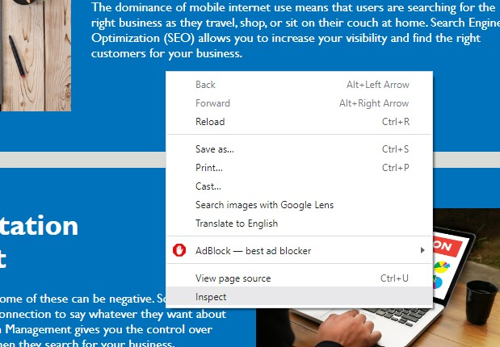
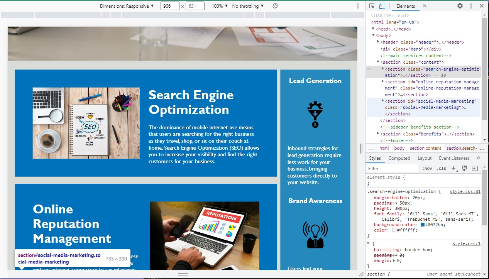

# Refactoring Horiseon Webpage

## Description

This repo contains refactored code for the Horiseon webpage. In our class this past week we learned of the importance of refactoring. The motivation for this project was to get hands on experience with refactoring code.

## Installation

N/A

## Usage

By opening Chrome Dev Tools (right-click on the webpage and select inspect) you can view the code for the page and see how different parts of the code are affecting different sections of the webpage. 

 Right-click to select inspect.

 View the code through Dev Tools.

## Credits

N/A

## License 

N/A